# Titanic Dataset Analysis

## Overview
This project involves performing **data cleaning** and **exploratory data analysis (EDA)** on the Titanic dataset from Kaggle. The dataset contains information about passengers on the Titanic, including whether they survived or not. This analysis explores the relationships between various features and identifies patterns and trends in the data.

## Dataset Description
The Titanic dataset comprises three files:
1. **`train.csv`**: Training dataset containing labeled data with the target variable (`Survived`).
2. **`test.csv`**: Test dataset without the target variable, used for making predictions.
3. **`gender_submission.csv`**: Example submission file.

### Key Columns in the Dataset:
- **PassengerId**: Unique ID for each passenger
- **Survived**: Survival status (0 = No, 1 = Yes)
- **Pclass**: Passenger class (1 = 1st, 2 = 2nd, 3 = 3rd)
- **Name**: Name of the passenger
- **Sex**: Gender of the passenger
- **Age**: Age of the passenger
- **SibSp**: Number of siblings/spouses aboard
- **Parch**: Number of parents/children aboard
- **Ticket**: Ticket number
- **Fare**: Passenger fare
- **Cabin**: Cabin number
- **Embarked**: Port of embarkation (C = Cherbourg, Q = Queenstown, S = Southampton)

---

## Project Features

### 1. Data Cleaning
- Filled missing values for:
  - **Age**: Using median values grouped by `Pclass` and `Sex`.
  - **Embarked**: Using the mode.
  - **Fare**: Using the median.
- Dropped the **Cabin** column due to excessive missing data.
- Extracted **Title** from the `Name` column for feature engineering.
- Mapped categorical variables (`Sex`, `Embarked`, `Title`) to numeric values.

### 2. Exploratory Data Analysis (EDA)
Performed in-depth analysis with visualizations to explore:
- **Distributions**:
  - Age and Fare distributions.
- **Survival Relationships**:
  - By `Sex`, `Pclass`, `Embarked`, and `Title`.
- **Correlation Analysis**:
  - Heatmap of correlations between numerical variables.
- **Pairwise Relationships**:
  - Pairplot of key features colored by survival.
- **Scatterplot**:
  - Relationship between `Age`, `Fare`, and `Survival`.

### 3. Visualization Highlights
- **Custom color palettes** for better aesthetics.
- **Bar plots** for categorical features.
- **Histograms** and **scatterplots** for continuous variables.
- **Correlation heatmap** for numerical insights.

---

## Technologies Used
- **Python**: For data analysis and visualization.
- **Pandas**: Data manipulation and cleaning.
- **NumPy**: Numerical computations.
- **Seaborn**: Advanced data visualizations.
- **Matplotlib**: Data visualization.

---

## How to Run the Project

### Prerequisites
1. Install Python (>=3.7).
2. Install the required Python libraries using:
   ```bash
   pip install pandas numpy matplotlib seaborn
   ```

### Running the Code
1. Clone this repository or download the project files.
2. Open the `analysis.py` file in your code editor.
3. Run the script using:
   ```bash
   py analysis.py
   ```

### Output
- Visualizations of distributions, survival rates, and correlations.
- Summary statistics and insights from the dataset.

---

## Key Insights
- **Gender**: Females had a significantly higher survival rate than males.
- **Passenger Class**: Passengers in 1st class were more likely to survive than those in 2nd or 3rd class.
- **Embarkation Port**: Passengers embarking from Cherbourg had higher survival rates.
- **Age**: Younger passengers had higher survival probabilities.
- **Fare**: Passengers who paid higher fares were more likely to survive.

---

---
## Graphs and Screenshots
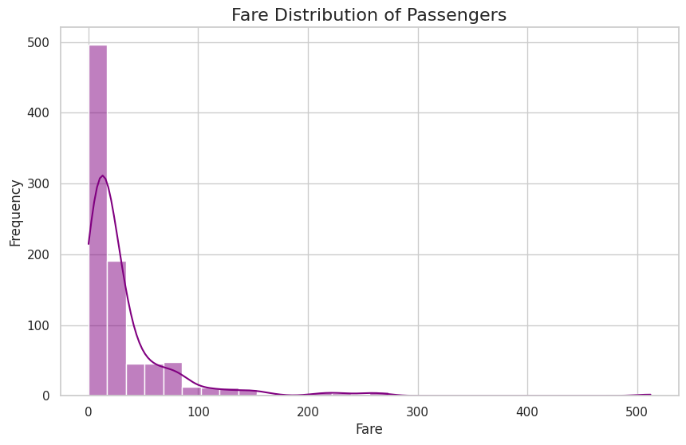
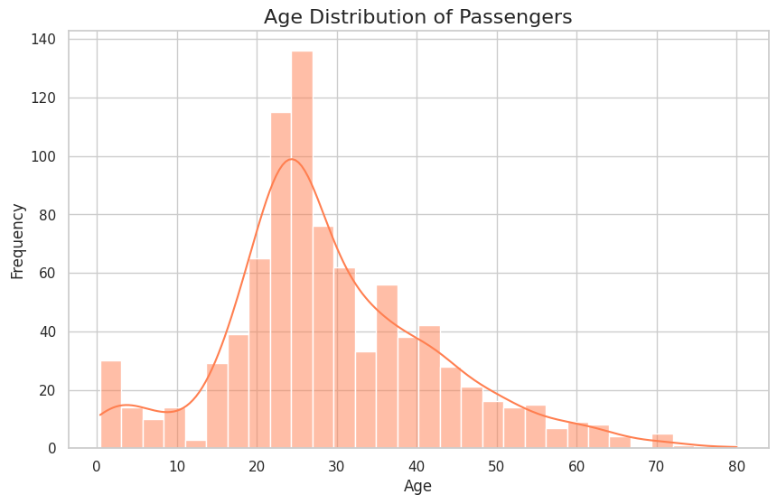
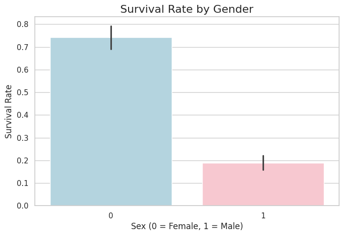
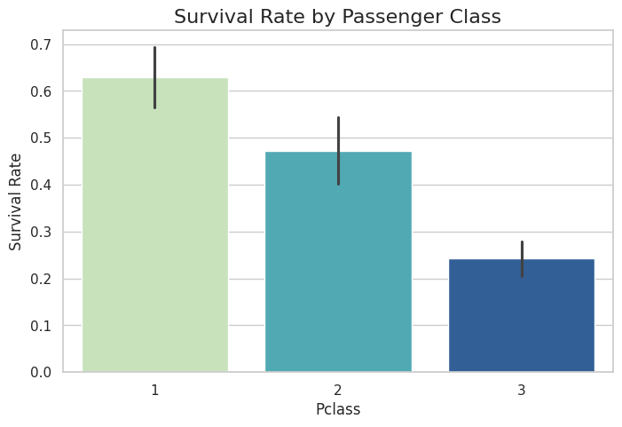
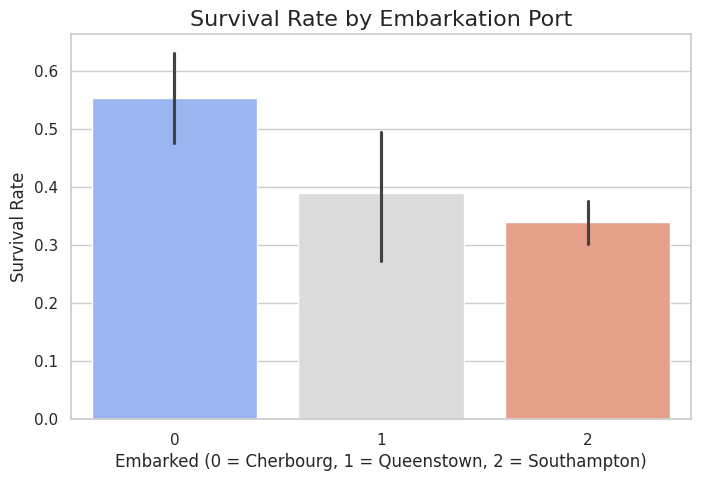
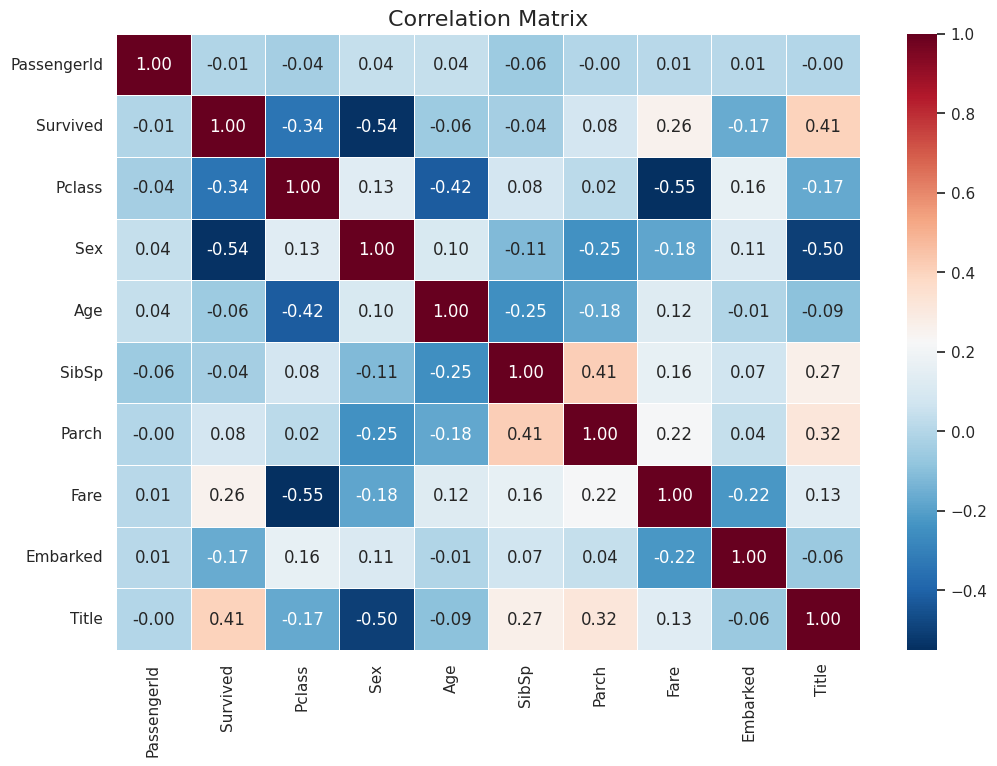
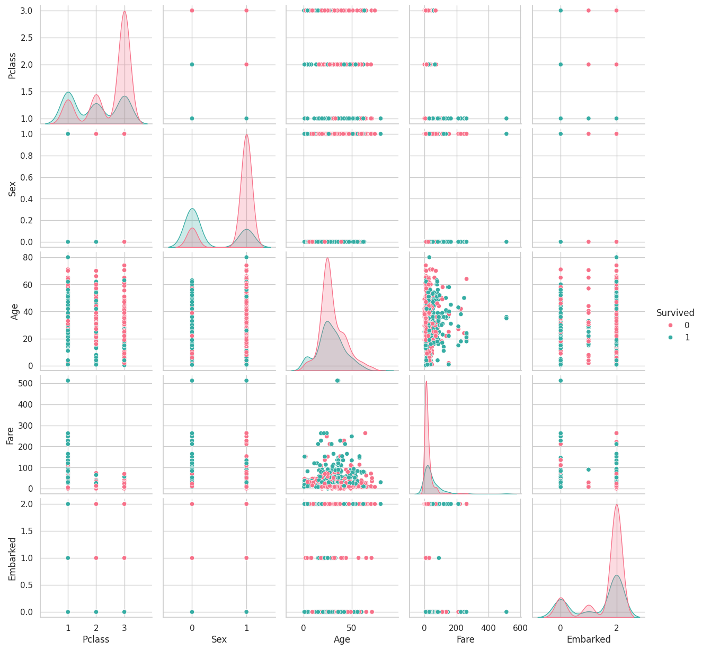
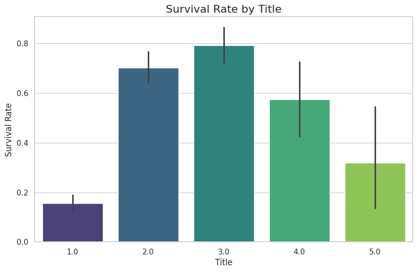
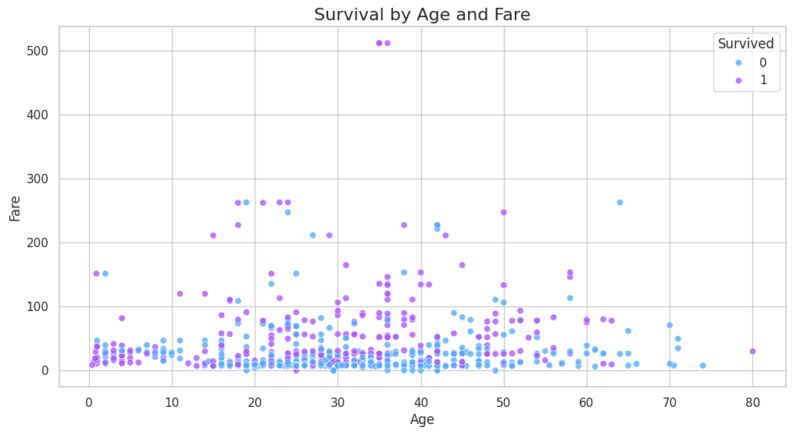
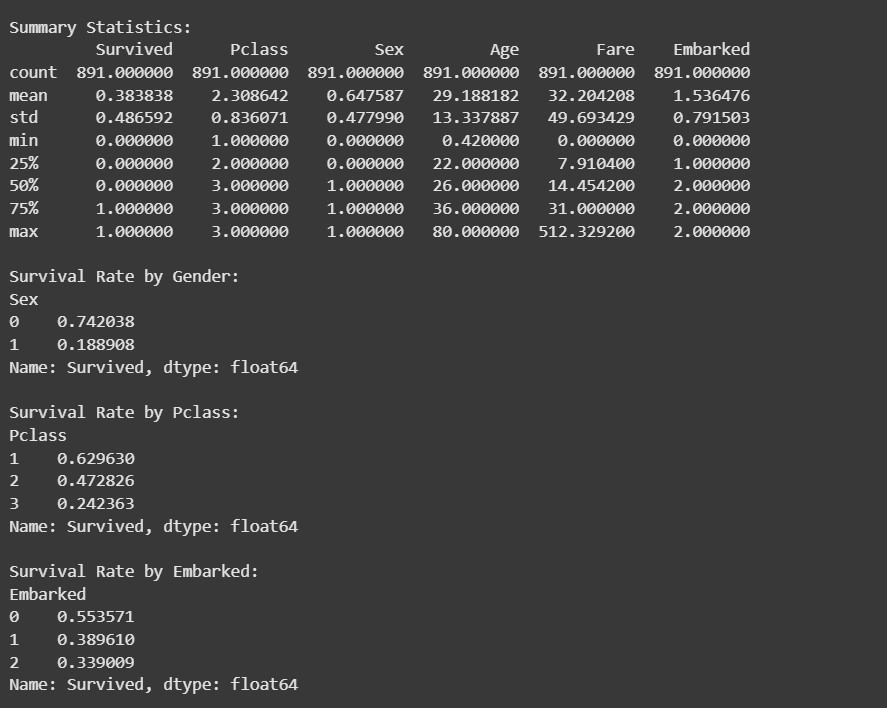
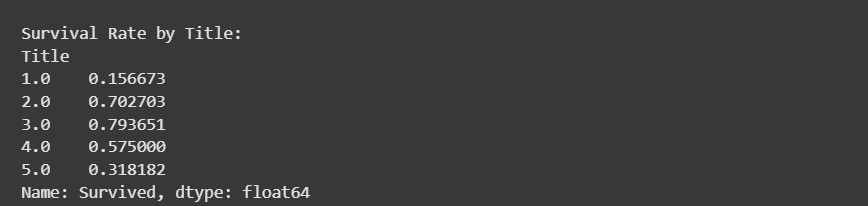

---

## Future Improvements
1. Train machine learning models to predict survival on the test dataset.
2. Explore advanced feature engineering techniques.
3. Optimize hyperparameters of models for better performance.

---

## Acknowledgments
- Dataset provided by [Kaggle](https://www.kaggle.com/c/titanic).
- Visualization inspiration from the data science community.

---

## License
This project is licensed under the [MIT License](LICENSE). Feel free to use and modify the code for your own projects.

---

**Author**: Siddharth B N  

